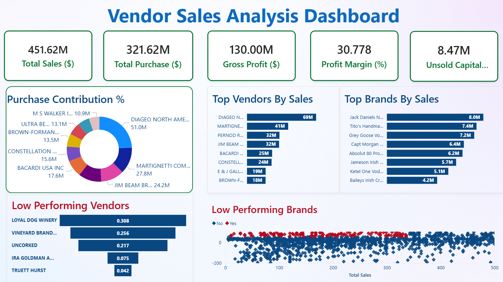

<div align="center">

# 🛒 Vendor Sales Analysis

**End-to-end vendor performance intelligence — from cloud storage to interactive dashboards**


</div>

---

## 📌 Overview

This project performs a **comprehensive vendor sales analysis** using a cloud-first data pipeline. Raw sales data is stored in **AWS S3**, loaded into **AWS RDS** for structured querying, analyzed through Python notebooks, and visualized in an interactive **Power BI dashboard** — giving stakeholders clear, actionable vendor performance insights.

---

## 📊 Dashboard Preview



---

## ☁️ Cloud Architecture

```
Raw Data (CSV)
     │
     ▼
┌─────────────┐        ┌─────────────┐        ┌─────────────────┐
│   AWS S3    │───────▶│   AWS RDS   │───────▶│ Python Notebooks│
│  (Data Lake)│        │  (Database) │        │  EDA + Analysis │
└─────────────┘        └─────────────┘        └────────┬────────┘
                                                        │
                                                        ▼
                                               ┌─────────────────┐
                                               │    Power BI     │
                                               │   Dashboard     │
                                               └─────────────────┘
```

| Service | Role |
|--------|------|
| 🪣 **AWS S3** | Central data lake — stores raw vendor sales CSV files and processed exports with scalable, durable object storage |
| 🗄️ **AWS RDS** | Managed relational database — hosts the structured vendor sales tables, enables SQL querying from Python notebooks |

---

## 🗂️ Project Structure

```
Vendor_Sales_Analysis/
│
├── 📓 Database Creation.ipynb           # Data ingestion: S3 → RDS pipeline
├── 🔍 EDA.ipynb                         # Exploratory Data Analysis
├── 📊 Vendor Performance Analysis.ipynb # Vendor KPIs & rankings
├── ⚡ Vendor_sales_Analysis.pbix        # Power BI interactive dashboard
├── 📄 vendor_sales_summary.csv          # Aggregated sales export
└── 🖼️  DashBoard.png                    # Dashboard preview
```

---

## 🔄 Analysis Pipeline

### Step 1 — Database Creation & Cloud Setup
> Raw CSV data is uploaded to **AWS S3** as the central data lake. It is then ingested into **AWS RDS** where tables are cleaned, types enforced, and missing values handled — creating a reliable foundation for analysis.

### Step 2 — Exploratory Data Analysis
> Statistical summaries, distribution plots, time-series trends, and outlier detection across vendors, categories, and time periods. Identifies what's driving or dragging overall performance.

### Step 3 — Vendor Performance Analysis
> Deep-dive into vendor KPIs: revenue rankings, contribution share, margin analysis, and growth comparisons. Highlights high-value vendors and surfaces those needing attention.

### Step 4 — Power BI Dashboard
> Interactive visuals for business stakeholders with slicers by vendor, time, and category. KPI summary cards, trend lines, and comparative charts make insights accessible to non-technical users.

---

## 🛠️ Tech Stack

| Tool | Purpose |
|------|---------|
| 🐍 **Python** | Core programming language |
| 🐼 **Pandas** | Data manipulation & wrangling |
| 📈 **Matplotlib** | Static data visualizations |
| 🎨 **Seaborn** | Statistical plotting |
| 📓 **Jupyter Notebook** | Interactive analysis environment |
| ⚡ **Power BI** | Business intelligence dashboard |
| 🪣 **AWS S3** | Cloud object storage / data lake |
| 🗄️ **AWS RDS** | Managed relational cloud database |

---

## 🚀 Getting Started

### Prerequisites

- Python 3.8+
- Jupyter Notebook or JupyterLab
- Power BI Desktop
- AWS account with S3 bucket and RDS instance configured

### Installation

```bash
# 1. Clone the repository
git clone https://github.com/vikas-sachan870/Vendor_Sales_Analysis.git
cd Vendor_Sales_Analysis

# 2. Install dependencies
pip install pandas numpy matplotlib seaborn jupyter boto3 sqlalchemy pymysql

# 3. Launch Jupyter
jupyter notebook
```

### Run Order

```
1. Database Creation.ipynb            ← Sets up S3 → RDS pipeline
2. EDA.ipynb                          ← Exploratory analysis
3. Vendor Performance Analysis.ipynb  ← KPI deep-dive
4. Open Vendor_sales_Analysis.pbix in Power BI Desktop
```

---

## 📈 Key Insights

- ✅ Identified top vendors driving the majority of total revenue
- ✅ Revealed seasonal trends impacting sales performance
- ✅ Highlighted underperforming vendors with potential for growth
- ✅ Built a cloud-backed pipeline from raw data to business dashboard
- ✅ Provided actionable metrics to support vendor management decisions

---

## 👤 Author

**Vikas Sachan**
- GitHub: [@vikas-sachan870](https://github.com/vikas-sachan870)

---

## 📄 License

This project is open source and available under the [MIT License](LICENSE).

---

<div align="center">
  <sub>Built with ❤️ using Python, AWS & Power BI</sub>
</div>
